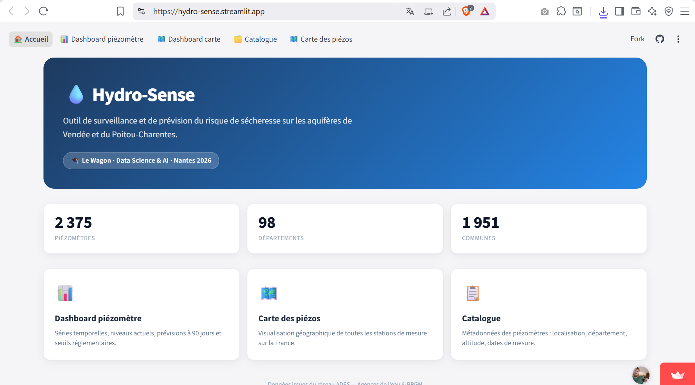
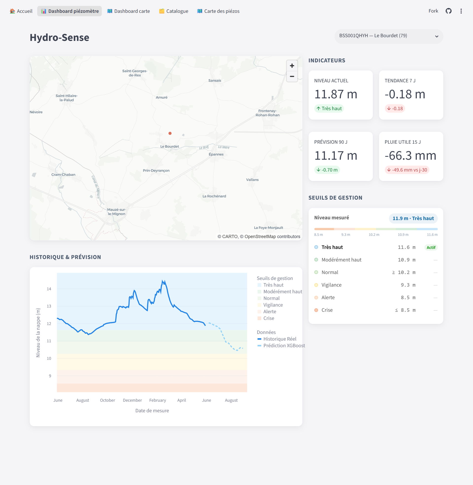
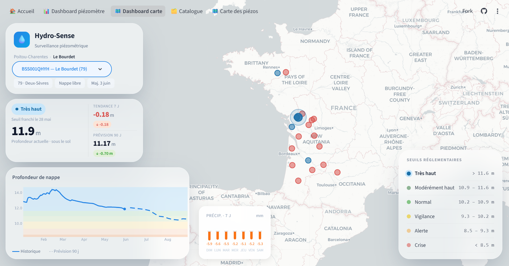
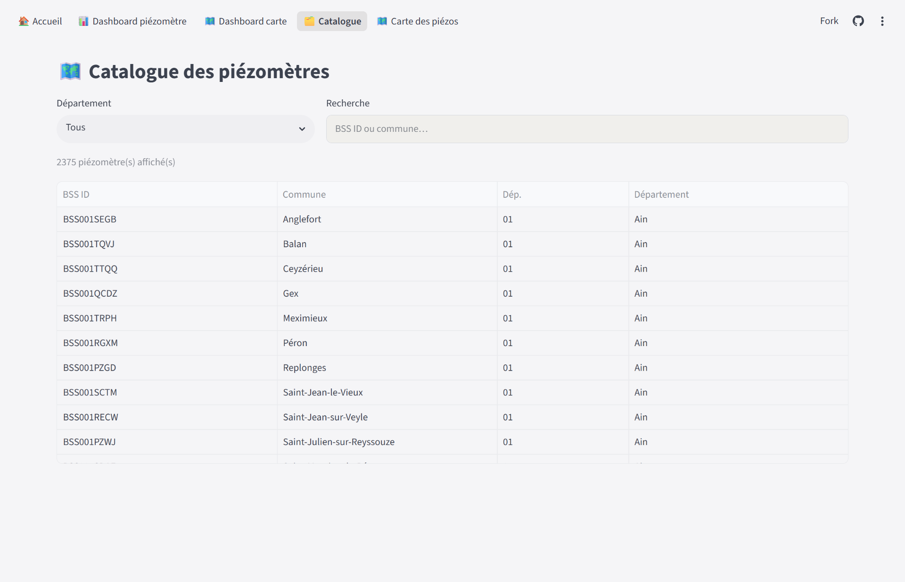

# 💧 Hydro-Sense : Prédire l'Invisible

> Anticiper les seuils d'alerte des nappes phréatiques grâce au Machine Learning.

Projet réalisé dans le cadre du bootcamp **Le Wagon Data Science & AI** — Nantes, batch #2275 (7 avril – 12 juin 2026).

**🔗 Démo live :** [hydro-sense.streamlit.app](https://hydro-sense.streamlit.app) · **API :** [hydrosense-api](https://hydrosense-api-121714908762.europe-west1.run.app/docs)· **📊 Présentation :** [Demo_HydroSense.pdf](Demo_HydroSense.pdf)

### 🎬 Diaporama


---

## 🎯 Objectif

Concevoir un modèle ML agile capable de **prédire le niveau des nappes phréatiques à 90 jours** sur des piézomètres cibles du Poitou-Charentes, en anticipant le franchissement des seuils réglementaires (Vigilance / Alerte / Alerte Renforcée / Crise).

Le BRGM suit environ **1 800 piézomètres** en France, mais ses modèles physiques existants (Gardénia, Tempo) sont fiables en suivi temps réel tout en restant lourds et peu adaptés à une prévision légère et rapide à déployer. Hydro-Sense propose une alternative ML, légère, localisée et déployable en production.

### Objectifs du projet
- Exploiter la mémoire des eaux souterraines
- Anticiper le franchissement des seuils réglementaires
- Périmètre pilote : 20+ piézomètres en Vendée et Poitou

---

## 🗺️ Contexte

La Vendée et le Poitou-Charentes subissent des **tensions hydriques extrêmes** sur leurs aquifères régionaux, avec des conflits d'usage récurrents (agriculture vs. écologie) et des enjeux de préservation du Marais poitevin.

Projections climatiques à horizon 2050 (vs. période 1976-2005) qui motivent le projet :
- **-10%** des cumuls de pluie en été
- **2 fois plus** de sécheresse des sols
- **2 milliards de m³ d'eau** manquants si la demande reste stable

---

## 📊 Données

### Sources principales

| Source | Type | Accès |
|--------|------|-------|
| [Hubeau — Piézométrie](https://hubeau.eaufrance.fr/page/api-niveaux-nappes) | Niveaux piézométriques (réseau Ades) | REST API |
| [Météo-France](https://portail-api.meteofrance.fr) | Précipitations et températures | REST API |
| [BDLISA](https://bdlisa.eaufrance.fr) | Indicatifs géologiques des entités hydro | Web |
| [Eaufrance / Sandre](https://www.eaufrance.fr) | Indicatifs de masse d'eau | Web |
| Rapport BRGM/RP-61807-FR (Vernoux, Seguin) | Seuils PSI de gestion | PDF |

Les données sont centralisées dans **Google BigQuery** (`hydro-sense-498112.piezometry`), avec les tables `chroniques_piezo`, `cat_piezo_raw` et `cat_piezo_interm`.

### Piézomètres-cibles (Poitou-Charentes)

- `BSS001PGUQ` — St-Gelais (Deux-Sèvres, 79)
- `BSS001QTKG` — Sauge (Deux-Sèvres, 79)
- `BSS001QSMT` — Bonnardelière (Vienne, 86)

---

## 🧪 Feature engineering

- **Pluie "alentour"** : interpolation spatiale par KNN (n_neighbors=5, pondération "inverse distance")
- **Pluie efficace (PU)** : `PU = RR - ETO`, calculée via l'équation FAO 56 Penman-Monteith simplifiée
- **Mémoire de la couche géologique** : recherche des indicatifs géologiques BDLisa et des masses d'eau Sandre pour chaque station (ex. au Bourdet : entité 352AC01, masse d'eau GG106 — calcaires et marnes du Jurassique supérieur de l'Aunis)
- **Analyse en composantes principales (PCA)** sur les covariables météo/hydrologiques
- **Décomposition saisonnière** du signal piézométrique (tendance pluriannuelle, cycle annuel recharge/vidange, résidus liés aux anomalies et pompages)
- **Lags temporels** : `semaine_sin`/`semaine_cos`, `lag_1` à `lag_52`, avec des décalages différents pour la pluie et pour la roche selon la réactivité du système
- **Moyennes glissantes** : `moyenne_3w`, `moyenne_6w`

---

## 🧠 Modélisation

**Approche :** 17 features, ~700 à 2 000 lignes par station, données moyennées à la semaine et standardisées. Chaque système hydrogéologique a son propre modèle — la dynamique de nappe n'est pas généralisable d'une station à l'autre (nappe vs. karst). Une baseline saisonnière est systématiquement mise en place. Validation croisée spécifique aux séries temporelles, avec un focus sur la vidange estivale. Métriques retenues : **MAE, RMSE, Max Error, RMSSE**.

### Résultats — comparaison sur 19 nappes

Le choix du modèle final s'est appuyé sur un benchmark élargi à 19 nappes (au-delà des 3 piézomètres-cibles retenus pour le déploiement), afin de comparer les approches sur un périmètre plus représentatif :

| Modèle | Erreur moyenne (m) | Score d'écart de précision |
|--------|---------------------|------------------------------|
| **Random Forest** | **0.53** | **2.07** |
| **XGBoost** | **0.53** | **2.07** |
| ElasticNet | 0.60 | 2.25 |
| Lasso | 0.60 | 2.25 |
| SARIMAX (modèle statistique) | 0.82 | 2.57 |
| Semaine dernière (naïf) | 0.86 | 2.76 |
| Persistance saisonnière | 1.51 | 4.69 |

Random Forest et XGBoost se disputent la meilleure performance. SARIMA a été utilisé comme modèle univarié de référence, LASSO en multivarié pour valider le choix des features, et XGBoost a permis de mettre en évidence une tendance à l'overfitting.

---

## 🏗️ Architecture déployée (MLOps)

```
BigQuery (données brutes)
        │
        ▼
Packaging (hydrosense package — pipeline ML)
        │
        ▼
FastAPI ──── Docker ──── Google Cloud Run (europe-west1)
        │
        ▼
Streamlit Dashboard (hydro-sense.streamlit.app)
```

1. **Data BigQuery** — stockage centralisé des séries piézométriques et météo
2. **Packaging** — pipeline `hydrosense` : `load_piezo_bq` → `clean_piezo` → `preprocess_week` → `train` → `pred_future` (prédiction autorégressive sur 13 semaines)
3. **API** — FastAPI + Uvicorn, expose les prédictions par station
4. **Docker** — conteneurisation de l'API
5. **Cloud Run** — déploiement sur Google Cloud Run, credentials GCP gérés via Secret Manager
6. **Streamlit** — dashboard utilisateur

**CI/CD** : GitHub Actions, déploiement automatique à chaque push sur `master`.

---


## 🖥️ Dashboard

Application Streamlit ([hydro-sense.streamlit.app](https://hydro-sense.streamlit.app)) couvrant **2 375 piézomètres**, **98 départements** et **1 951 communes**, avec 4 pages :

- **Accueil** — vue d'ensemble et statistiques clés
- **Dashboard piézomètre** — séries temporelles, niveaux actuels, prévisions à 90 jours et seuils réglementaires
- **Dashboard carte** / **Carte des piézos** — visualisation géographique de toutes les stations de mesure sur la France, carte interactive Folium avec marqueurs colorés selon le niveau d'alerte
- **Catalogue** — métadonnées des piézomètres (localisation, département, altitude, dates de mesure)

### Captures d'écran

**Accueil**


**Dashboard piézomètre** — indicateurs en temps réel (niveau actuel, tendance 7j, prévision 90j, pluie utile 15j), carte de localisation, seuils de gestion et courbe historique + prédiction XGBoost


**Dashboard carte** — vue nationale interactive avec statuts d'alerte par station, précipitations récentes et seuils réglementaires


**Catalogue** — recherche et filtrage des 2 375 piézomètres par département ou commune

---

## 🚧 Défis et apprentissages

1. **Intégration des précipitations utiles** avec des temps d'assimilation différents pour chaque nappe
2. **Affichage des seuils d'alerte**, très différents selon les sources de la documentation scientifique
3. **Choisir un modèle performant et non biaisé**
4. **Gestion des performances en ligne** (latence, ré-entraînement à la volée)

---

## 🔮 Perspectives

1. Créer une version **responsive mobile**
2. **Diminuer la latence** de l'application Hydro-Sense
3. **Déploiements géographiques** vers d'autres départements anticipés
4. Intégration d'**alertes automatiques** pour un suivi en temps réel

---

## 🚀 Installation

### 1. Cloner le repo

```bash
git clone git@github.com:charourou/Projet_Hydrosense.git
cd Projet_Hydrosense
```

### 2. Créer l'environnement Python

```bash
pyenv install 3.10.6
pyenv virtualenv 3.10.6 Projet_Hydrosense
pyenv local Projet_Hydrosense
```

### 3. Installer les dépendances

```bash
pip install -r requirements.txt
```

Pour un déploiement API allégé, utiliser `requirements-api.txt`.

### 4. Configurer les variables d'environnement

Créer un fichier `.env` à la racine :

```
GOOGLE_APPLICATION_CREDENTIALS=<chemin absolu vers la clé de service GCP>
GOOGLE_PROJECT_ID=hydro-sense-498112
BQ_DATASET_ID=piezometry
```

### 5. Lancer l'application

```bash
make install       # première installation
streamlit run app/streamlit_app.py
```

---

## 👥 Équipe

Projet Le Wagon Nantes — Batch #2275 (7 avril – 12 juin 2026)

| Membre | Rôle |
|--------|------|
| **Maxime Richard** | Lead projet, data engineering & modélisation |
| **Yann Simon** | Infrastructure, déploiement, dashboard Streamlit |
| **Romain Huchet** | EDA, modélisation & feature engineering |

---

## 📚 Références

- BRGM — [MétéEAU Nappes](https://www.brgm.fr/fr/solutions/meteeau-nappes-outil-suivi-temps-reel-prevision-niveau-nappes)
- Surdyk et al. (2022) — *MétéEAU Nappes: a real-time water-resource-management tool*
- Beuchée, Guyet, Malinowski — *Prédiction du niveau de nappes phréatiques : comparaison d'approches locale, globale et hybride*
- Vernoux, Seguin — Rapport BRGM/RP-61807-FR (seuils PSI de gestion)
- [Notions d'hydrogéologie — SIGES](https://www.siges.fr/fr/mon-territoire/national/notions-dhydrogeologie)